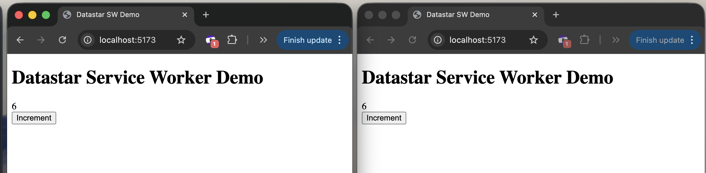

# Datastar Service Worker Demo

An experimental implementation of a server running inside a Service Worker that maintains SSE connections with Datastar.



## Architecture

This project demonstrates:

- **Service Worker as Server**: The service worker intercepts fetch requests and serves responses, acting as a backend server in the browser
- **[@remix-run/fetch-router](https://github.com/remix-run/remix/tree/main/packages/fetch-router)**: Minimal, composable router built on the Fetch API - perfect for service workers
- **[Datastar](https://data-star.dev)**: Frontend framework that communicates with the service worker via SSE
- **In-Memory State**: Counter state maintained in the service worker
- **Event-Driven Updates**: POST to `/increment` dispatches events that SSE connections listen to

## How It Works

1. **Initial Load**: Browser loads `index.html` which registers the service worker
2. **Service Worker Activation**: `sw.js` activates and intercepts all same-origin fetch requests
3. **Route Handling**:
   - `GET /` - Returns HTML when accessed directly, or opens an SSE connection when `Datastar-Request: true` header is present
   - `POST /increment` - Increments counter and dispatches an event
4. **Real-Time Updates**: SSE connections listen for increment events and patch the DOM via `datastar-patch-elements`

## Getting Started

```bash
npm install
npm run dev
```

Open <http://localhost:5173> and click the "Increment" button to see real-time updates.

## Project Structure

```
.
├── index.html           # Entry point that registers the service worker
├── sw.js               # Service worker with routing and SSE logic
├── vite.config.js      # Vite configuration
├── vite-plugin-sw.js   # Custom plugin to bundle SW for dev mode
└── package.json
```

## Service Worker Development Caveats

### Critical: Force Update Service Worker After Changes

Service workers are **aggressively cached** by browsers. When you make changes to `sw.js` and restart the dev server, you MUST force the browser to update the service worker:

**Option 1: Hard Refresh (Recommended)**

- Chrome/Edge: `Ctrl+Shift+R` (Windows/Linux) or `Cmd+Shift+R` (Mac)
- Firefox: `Ctrl+F5` (Windows/Linux) or `Cmd+Shift+R` (Mac)

**Option 2: DevTools**

1. Open DevTools
2. Go to **Application** tab → **Service Workers**
3. Check **"Update on reload"** checkbox
4. Click **"Unregister"** if the old worker is stuck
5. Refresh the page

**Option 3: Manual Unregister**

```javascript
// Run in console
navigator.serviceWorker.getRegistrations().then((registrations) => {
  registrations.forEach((r) => r.unregister());
});
// Then refresh the page
```

### Development Tips

1. **Check Console for `[SW]` Logs**: The service worker includes extensive logging prefixed with `[SW]` to help debug state issues

2. **Multiple Tabs = Multiple SSE Connections**: Each browser tab creates its own SSE connection. This is normal behavior.

3. **State Persists Until SW Restarts**: The counter state lives in the service worker's memory. It persists across page refreshes but resets when:
   - The service worker is unregistered
   - The browser is closed
   - The service worker is terminated by the browser (usually after ~30s of inactivity)

4. **Watch for Installation Messages**: When the service worker installs/activates, you'll see:

   ```
   [SW] Service Worker initializing, counter: 0
   [SW] Service Worker installing
   [SW] Service Worker activating
   ```

5. **`skipWaiting()` is Enabled**: The service worker uses `skipWaiting()` to activate immediately, but you still need to refresh to use the new version

### Common Issues

**Problem**: Counter shows wrong value or jumps around

- **Cause**: Old service worker is still running
- **Fix**: Hard refresh or unregister the service worker

**Problem**: Changes to `sw.js` don't appear

- **Cause**: Browser is using cached service worker
- **Fix**: Unregister the service worker and refresh

**Problem**: Console shows service worker registration failed

- **Cause**: Vite plugin failed to bundle the service worker, or syntax error in `sw.js`
- **Fix**: Check the console for errors, restart dev server

## Build for Production

```bash
npm run build
```

The built files will be in the `dist/` directory. Note that service workers require HTTPS in production (or localhost for development).

## Datastar SSE Events

The service worker uses two Datastar SSE event types:

### `datastar-patch-elements`

Patches DOM elements by ID:

```javascript
event: datastar-patch-elements
data: elements <div id="counter"><span>1</span></div>
```

### `datastar-patch-signals`

Updates Datastar signals:

```javascript
event: datastar-patch-signals
data: signals {"count": 1}
```

## Future Ideas

- JSX templating for HTML generation
- Multiple routes with different SSE streams
- Persistent state using IndexedDB
- Service worker → service worker communication for multi-tab sync
