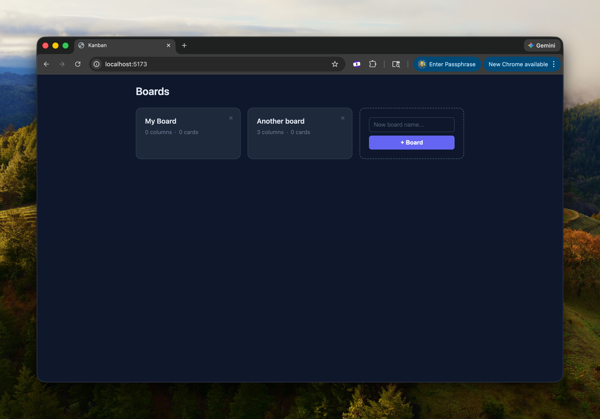
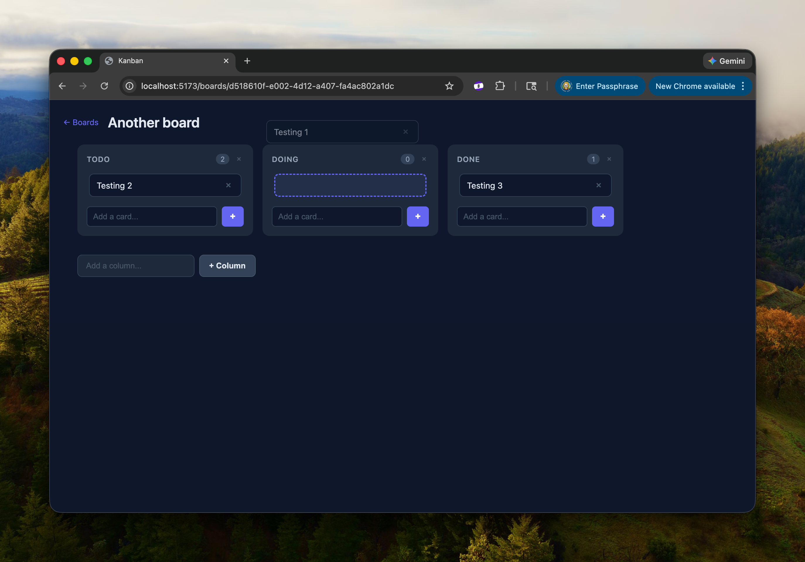

# datastar_sw

[](https://render.com/deploy?repo=https://github.com/derekr/datastar-sw-experiment)

A local-first kanban board where the **service worker is the server**. The browser's main thread runs almost no JavaScript — [Datastar](https://data-star.dev) handles UI reactivity, and a [Hono](https://hono.dev) app inside the service worker handles all routing, rendering, persistence, and state management. Data lives in IndexedDB via [idb](https://github.com/nicolo-ribaudo/idb). An event-sourcing layer records every mutation for future cross-device sync.





## Why

Most local-first browser apps put the database, state management, and rendering logic all on the main thread. Frameworks like React or Svelte own the DOM, and persistence is bolted on as a side effect. The result is a thick client that happens to store data locally.

This project inverts that. The service worker acts as a real HTTP server — it has routes, renders HTML, streams SSE, and writes to a database. The main thread is a thin hypermedia client that consumes HTML and sends requests. The architecture is closer to a traditional server-rendered app than a typical SPA, except the server lives in the browser.

The bet: if a service worker can be a server, you get local-first for free (no network needed), the mental model stays simple (request/response), and the main thread stays light (no framework, no state store, minimal JS).

## Architecture

```
Main thread                          Service Worker
┌───────────────────┐                ┌───────────────────────────────┐
│  Datastar         │◄── SSE ────────│  Hono + JSX                   │
│  (morph DOM)      │                │  ├─ Routes (GET/POST/PUT/DEL) │
│                   │── fetch() ────►│  ├─ Event sourcing            │
│  eg-kanban.js     │                │  ├─ Projection (derived state)│
│  (drag + keyboard)│                │  └─ idb (IndexedDB)           │
└───────────────────┘                └───────────────────────────────┘
```

**Request/response, not pub/sub.** Commands go via `fetch()`. Queries come back as SSE `datastar-patch-elements` events carrying full HTML fragments. Datastar morphs the DOM using Idiomorph. There's no client-side state store — the service worker is the source of truth.

### CQRS pattern

Commands (`POST`/`PUT`/`DELETE`) write events to the log, apply them to the projection, and return `204`. A scoped event bus notifies active SSE streams. Each SSE handler reads the current projection from IndexedDB and pushes a full HTML morph. Reconnecting an SSE stream replays the current state — no special rehydration path.

### Event sourcing

Every mutation creates one or more domain events (`card.created`, `column.moved`, etc.) with metadata: `correlationId`, `causationId`, `actorId`, timestamp, and a monotonic sequence number. Events are appended atomically via `appendEvents()`. A projection layer applies events to denormalized IndexedDB stores. Snapshots checkpoint the projection for fast startup; only events after the snapshot sequence are replayed.

Events are the source of truth. The projection is derived and rebuildable. The event log is designed for future sync via [S2](https://s2.dev) or similar, where devices exchange event streams and converge.

### View transitions

CSS `view-transition-name` on columns gives each column a stable identity. Columns use `view-transition-class: col` so a single CSS rule (`::view-transition-group(*.col) { z-index: 50 }`) ensures moving columns render above their siblings. Cards don't have individual VTNs — they're captured as part of their column's snapshot, so columns move as visual units with their cards. View transitions just react to DOM state changes from the SSE morph. No manual `startViewTransition()` calls, no attribute manipulation.

### Keyboard navigation

Arrow keys and vim `h`/`j`/`k`/`l` move focus between cards and column headers. `Ctrl`+Arrow/vim moves cards (within and across columns) and reorders columns. Moves emit the same `CustomEvent` as pointer drag, hitting the same `fetch()` handlers. A `MutationObserver` restores focus after the SSE morph replaces the DOM.

### Drag and drop

`eg-kanban.js` implements pointer-based drag using `pointerdown`/`pointermove`/`pointerup` — no native HTML5 DnD. Ghost placeholders reserve space. FLIP animations smooth sibling reflow. Drop events fire `fetch()` directly to SW routes (no Datastar signals needed). During pointer drag, all `view-transition-name`s are suppressed via a `data-kanban-active` attribute so the drag itself provides visual feedback without VT interference.

### Fractional indexing

Card and column positions use lexicographically sortable string keys via [`fractional-indexing`](https://github.com/rocicorp/fractional-indexing). Reordering computes a new key between neighbors with `generateKeyBetween()` — no renumbering of siblings. Integer drop indices from the drag/keyboard layer are converted to fractional keys server-side by `positionForIndex()`.

## Project structure

```
index.html           Bootstrap page — registers SW, shows loading state
sw.jsx               The entire server (~1400 lines): Hono app, JSX components,
                     event sourcing, idb persistence, SSE streaming, CSS
eg-kanban.js         Pointer drag + keyboard navigation library (~820 lines)
vite-plugin-sw.js    Custom Vite plugin: builds sw.jsx as IIFE, watches changes
vite.config.js       Vite config with JSX transform
```

## Getting started

```bash
pnpm install
pnpm dev
```

Open http://localhost:5173. The first load registers the service worker and redirects to the boards list. Create a board, add columns and cards, drag or keyboard-navigate.

## Developing with service workers

Service workers are a different development experience from typical client-side code. Some things to know:

### The update cycle is slow by design

Browsers aggressively cache service workers. When you change `sw.jsx`, Vite rebuilds it, but the browser won't use the new version until the old one is replaced. The SW calls `skipWaiting()` on install, which helps — but you often still need to reload twice (once to install, once to activate). During development, check "Update on reload" in DevTools > Application > Service Workers.

### You can't use the DOM

Service workers have no `document`, no `window`, no DOM APIs. You render HTML as strings (via JSX in our case) and send it over the wire. This is actually a feature — it enforces the server mental model and prevents the temptation to reach into the DOM.

### Debugging is indirect

`console.log` in the service worker shows up in a separate DevTools context (or in the Application > Service Workers panel). Errors in the SW don't show in the page console. You're debugging a background thread that communicates only through fetch responses and messages.

### SSE streams need careful lifetime management

`streamSSE` calls `stream.close()` in its `finally` block, so event-driven streams (where you wait for bus events rather than generating data in a loop) need a keep-alive pattern: `while (!stream.closed) { await stream.sleep(30000) }`. Without this the stream closes immediately.

### IndexedDB is your only storage

No filesystem, no SQLite, no localStorage. IndexedDB is async, transactional, and the API is awkward — `idb` wraps it into something usable. Schema migrations happen in the `upgrade` callback. The database persists across SW restarts, but the SW's in-memory state (event bus, actor ID cache) doesn't — rebuild from the DB on activation.

### The SW can be killed at any time

Browsers terminate idle service workers after ~30 seconds. Any in-memory state is lost. The event bus, cached actor ID, projection state — all gone. Design for cold starts: read from IndexedDB, rebuild what you need. The event sourcing snapshot/replay pattern handles this naturally.

## How this compares to typical local-first browser apps

| | Typical local-first SPA | This project |
|---|---|---|
| **Where logic lives** | Main thread (React/Svelte/etc.) | Service worker (Hono + JSX) |
| **Rendering** | Client-side framework | Server-rendered HTML over SSE |
| **State management** | Client store (Redux, signals, etc.) | IndexedDB projection, read on demand |
| **Persistence** | Side effect of client state | Source of truth (event log in IDB) |
| **Main thread JS** | Heavy (framework + app code) | Minimal (Datastar ~14KB + drag lib) |
| **Mental model** | Thick client with local DB | Thin client talking to local server |
| **Offline** | Needs sync engine + conflict resolution | Works offline by default (SW is the server) |
| **Multi-tab** | Shared state via BroadcastChannel or SharedWorker | Each tab has its own SSE stream; SW is shared |

The tradeoff: you give up the rich interactivity toolbox of a client-side framework. No reactive fine-grained updates, no component state, no hooks. What you get is a simpler architecture, almost no main-thread JS, and a clean separation between the "server" (SW) and the "client" (browser + Datastar).

## Dependencies

- **[hono](https://hono.dev)** — Router and JSX runtime for the service worker
- **[idb](https://github.com/nicolo-ribaudo/idb)** (~1.2KB) — Promise-based IndexedDB wrapper
- **[fractional-indexing](https://github.com/rocicorp/fractional-indexing)** (~2KB) — Lexicographic position keys
- **[Datastar](https://data-star.dev)** — Hypermedia client (loaded from CDN)
- **[Vite](https://vite.dev)** — Dev server and build tool

## License

MIT
